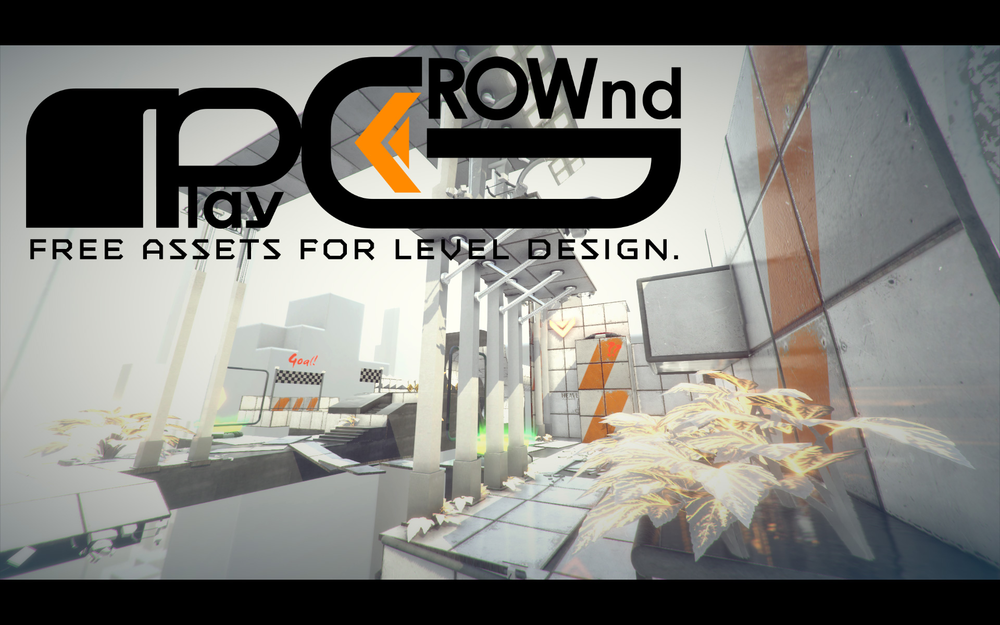
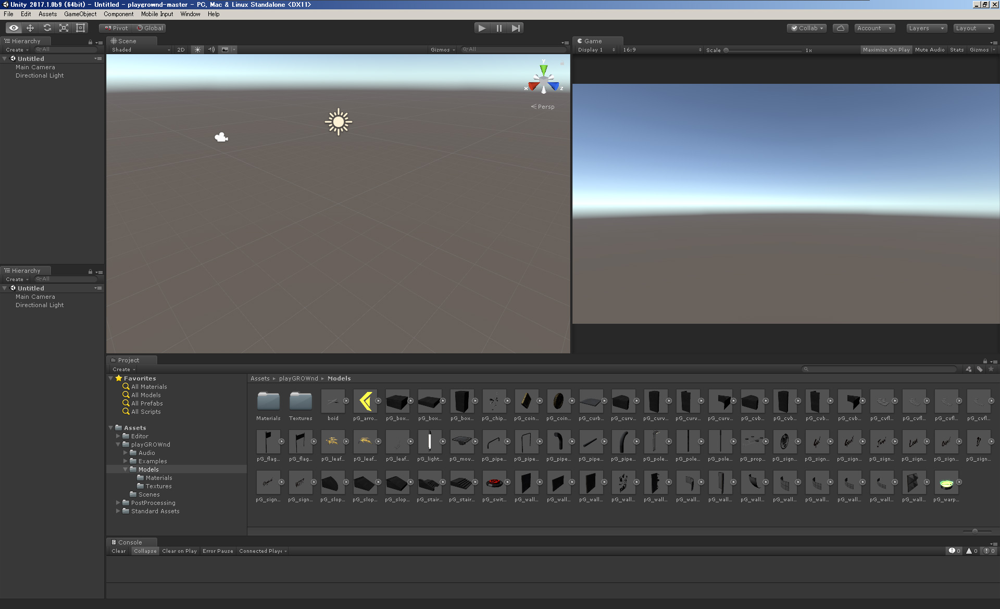
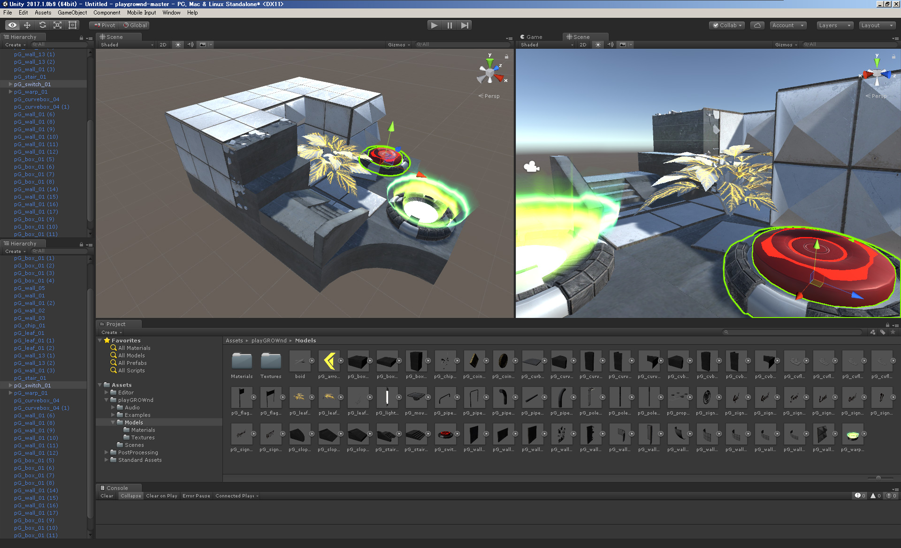

# playGROWnd
Free Unity assets for level design.

* playGROWndは自由に使えるレベルデザイン用のアセットです。
* Unityのバージョンは2017.1b9以降で制作されています。
* 全てが規格化され、ブロック遊びをするようにステージを制作できます。
* スキンドメッシュは存在しないので、FBXを3DCGツールで編集する事で欲しい形状を簡単に編集/追加できます。
* 多くのテクスチャはPSDで入っておりレイヤーも統合されておりませんので、自由に改変する事が出来ます。
* 同梱されているBGM等も全てMITライセンスでの提供です。

# How to use ?
* 右上の緑のボタン(Clone or Download)から任意の方式を選ぶか、この[パッケージ](http://neotenydesign.heteml.jp/playGROWnd/playGROWnd_170627.unitypackage)をダウンロードします。
* Zip及びGitのCloneについては解ってる人しか使わないと思うので頑張ってください。
* ダウンロードした.unitypackageをUnityにインポートしてください。

[解説動画(TWITCH)](https://www.twitch.tv/videos/153814022)

正常にインポートされるとこのような形になります。

playGROWnd/Models/以下に各種オブジェクトが入っています。  
HierarchyやSceneビューにドラッグして自由にブロック遊びを楽しみましょう。

# Hint
* オブジェクトを配置する時はSceneビューではなくHierarchyにドラッグすると初期座標が0になるので操作しやすい。
* オブジェクトを操作する時はCTRLを押しながらだと移動は1m単位、回転は15度単位になるので綺麗に配置出来る。
* 同じオブジェクトを並べたい時はCTRL+Dで複製できる。
* 調子に乗ってオブジェクトを増やしまくるとHierarchyが凄い事になるので空のオブジェクトの子で操作するとよい。
* Sceneビューに配置した場合はVを押しながら操作すると近接頂点にスナップする。(非推奨)
* オブジェクトをスケールする時はハンドル操作ではなくInspectorで数値入力するとよい。(2、4、8、等)
* まずは床から作るとよい。
* playGROWndのブロックは基本2m単位で作られている。

# License
The MIT License (MIT)

Copyright (c) 2014-2017, Unity Technologies

Permission is hereby granted, free of charge, to any person obtaining a copy
of this software and associated documentation files (the "Software"), to deal
in the Software without restriction, including without limitation the rights
to use, copy, modify, merge, publish, distribute, sublicense, and/or sell
copies of the Software, and to permit persons to whom the Software is
furnished to do so, subject to the following conditions:

The above copyright notice and this permission notice shall be included in
all copies or substantial portions of the Software.

THE SOFTWARE IS PROVIDED "AS IS", WITHOUT WARRANTY OF ANY KIND, EXPRESS OR
IMPLIED, INCLUDING BUT NOT LIMITED TO THE WARRANTIES OF MERCHANTABILITY,
FITNESS FOR A PARTICULAR PURPOSE AND NONINFRINGEMENT. IN NO EVENT SHALL THE
AUTHORS OR COPYRIGHT HOLDERS BE LIABLE FOR ANY CLAIM, DAMAGES OR OTHER
LIABILITY, WHETHER IN AN ACTION OF CONTRACT, TORT OR OTHERWISE, ARISING FROM,
OUT OF OR IN CONNECTION WITH THE SOFTWARE OR THE USE OR OTHER DEALINGS IN
THE SOFTWARE.
